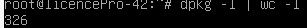
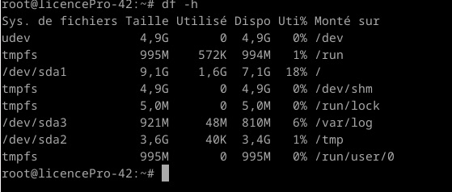
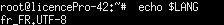
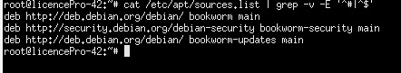

# Compte-rendu TP-01

## 1.2 Récupération de l'installeur

Lien de l'image que nous allons installer : `http://ftp.lip6.fr/pub/linux/distributions/debian/dists/bookworm/main/installer-amd64/current/images/netboot/`

Ensuite télécharger l'image `mini.iso`.

## 2. Post-Installation

### 2.1 Configuration ssh

Après avoir autorisé la connexion en modifiant la configuration de ssh, la ligne de `PermitRootLogin` a été modifiée et dé-commentée.

### 2.2 Connection

Pour se connecter à sa Machine virtuelle depuis l'hôte, d'abord récupérer son addresse ip avec la commande `ìp a`.
Ensuite, pour établir la connexion de la machine hôte vers sa VM, la commande utilisée est `ssh root@ ip de la machine virtuelle`.

### 2.3 Nombre de paquets

`dpkg -l | wc -l`

### 2.4 Space usage

`df -h`

Je pense respecter la bonne taille pour les différentes partitions, mais ayant dû supprimer et refaire les partitions j'ai préféré mettre la capture d'écran.

### 2.5 Commandes et résultat.

- `echo $LANG`: Affiche la langue choisi lors de la configuration.

- `hostname` : retourne le nom de la machine virtuelle qui est serveur1.

- `main hostname` : pour afficher l'aide pour avoir les commandes et trouver celle qui correspond au nom de domaine.
  `domainname` : pour afficher le nom de domaine.

- `cat /etc/apt/sources.list | grep -v -E ’^#|^$’` : Permet de vérifier l'emplacement des dépots de l'image
  

- `cat /etc/shadow | grep -vE ’:\*:|:!\*:’` : Permet d'afficher les mots de passes hashés des utilisateurs.

- `cat /etc/passwd | grep -vE ’nologin|sync’` : Affiche la liste des utilisateurs et des informations le concernant.

- `fdisk -l` : Je pense que cette commande liste les disques de partition.
  Avec leur taille, leur type mais aussi leur 'localisation' pour pouvoir y accéder.

- `fdisk -x` : Liste les disques avec plus d'informations comme l'identifiant unique de chacune des partitions, le type d'identifiant mais aussi le nom qui leur est attribué à leur initialisation.

- `df -h` : Liste les partitions avec le détail de leur capacité et l'espace qui est utilisé mais aussi disponible. Il y aussi le chemin sur lequel la partition a été monté.

## 3. Aller plus loin

### 3.1 `pressed`

Le fichier pressed permet de remplir automatiquement les questions qui sont posés lors des installations de debian.

### 3.2 `rescue mode` : Comment changer mon mot de passe ?

- Sur le GRUB de la machine virtuelle, chercher linux.
- Sélectionner la ligne linux, en bout de ligne rentrer la commande `rw rz init =/bin/bash`.
- Ctrl + x pour quitter
- Utiliser la commande `passwd root`. Le terminal demandera de rentrer le mot de passe et de le confirmer.

### 3.3 Redimentionnement partition

Utilisation de GPARTED pour redimensionner une ou plusieurs partitions.
Il faudra une clé USB bootable afin de lancer l'utilitaire de partitionnement de disque.
La manipulation étant bien expliquée sur le lien je le mets ici. [GPARTED](https://www.malekal.com/gparted-redimensionner-partition-de-disque/)

## Liens utiles

[Aide configuration ssh](https://linux.developpez.com/formation_debian/ssh.htmlcat)

[Aide sur la lecture de la liste des utilisateurs](https://linuxjourney.com/lesson/etc-passwd-file)

[GPARTED](https://www.malekal.com/gparted-redimensionner-partition-de-disque/)
